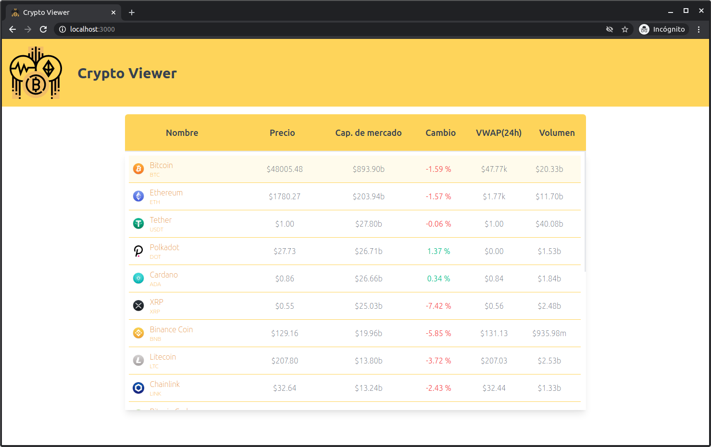

# React Simple Crypto Viewer
Frontend para consumir la API gratuita proporcionada por [Coincap](https://coincap.io/), consulta y muestra información relevante sobre las primeras 20 criptomonedas del ranking de dicha página. Se desarrolló con React utilizando create-react-app, componentes funcionales, los Hooks useReducer y useEffect y custom Hooks básicos para el manejo de peticiones fetch.

# Demo

Si desea ver una demo de este proyecto, puedes visitar el siguiente [Link](https://602b0a0136ca48b8e67c4b66--reverent-lumiere-c10a59.netlify.app/).

# Instalación y ejecución

Ejecute los siguientes comandos en una consola: 
```
git clone git@github.com:JDK-93/react-coincap-viewer.git
cd react-coincap-viewer
npm install
```
## Vista previa
<p align="center">
  
</p>

## Scripts disponibles

En el directorio del proyecto podrá ejecutar los siguientes scripts:

### `npm start`

Ejecuta la aplicación en modo de desarrollo.\
Abra [http://localhost:3000](http://localhost:3000) para verlo en el navegador.\
La página se volverá a cargar si realiza modificaciones.

### `npm test`

Launches the test runner in the interactive watch mode.\
See the section about [running tests](https://facebook.github.io/create-react-app/docs/running-tests) for more information.

### `npm run build`

Crea la aplicación para producción en la carpeta `build`.\
Consulte [implementación](https://facebook.github.io/create-react-app/docs/deployment) para obtener más información.
